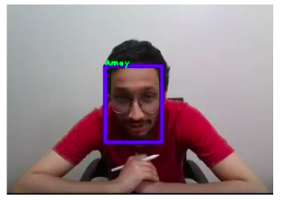
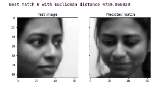
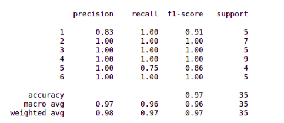
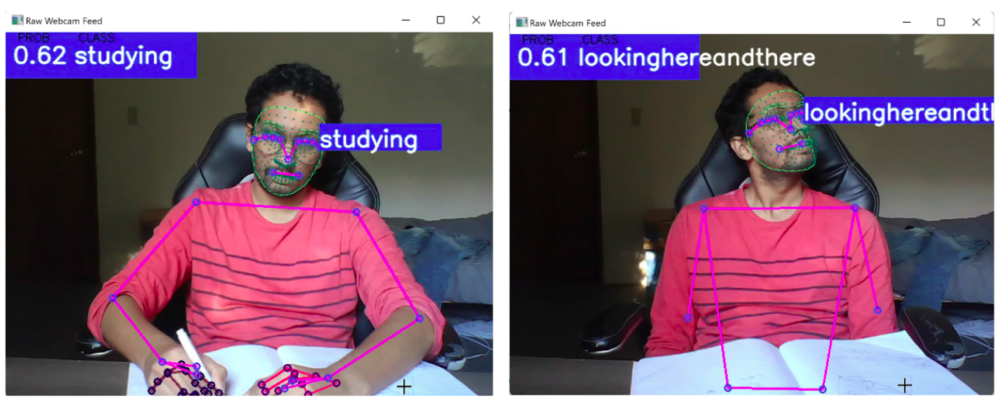

# Face recognition and Pose recognition for a Socially Assistive Robot

## Introduction

The use of socially assistive robots in Applied Behavioral Analysis (ABA) therapy has proven to help therapists focus more on the session rather than keeping a track of the child's progress. For this project, we consider ABA therapy sessions conducted for Autism Spectrum Disorder. The scenario considered here involves the use of PABI (Penguin for Autism Behavioral Intervention), a socially assistive robot created specifically to assist  in ABA therapies. It is equipped with Intel REalSense camera which is used for data recording, data logging and further analysis. Face and pose recognition can help determine behavioral aspects of patients during ABA therapy. 

## Data Collection

Every person who is admitted into the ABA therapy sesiion will get their face profile recorded by taking series of pictures of them with different face orientations. These pictures are then labelled with the person's name. If the person is attending the therapy session for the first time, then a new folder with hiss/her name is created, where the labelled images are added. This database is then used for creation of a face recognition model. To get a dataset for pose recognition, the subjects were asked to mimic writing while sitting on a chair in front of the camera. This pose was considered to be the basis for pose classification. Five minute recordings were stored in the respective folders.

 

Fig 1: Generated database

## Face Recognition

Face recognition at the beginning of a therapy session is necessary for storing the patient's data to their respective folders. For this, two approaches were used. First was using FaceNET model which resulted in 100% accuracy for the collected data. 

 

Fig 2: FaceNET result

To reduce the computational cost for larger dataset, Principal Component Analysis was implemented. Collected data was pre-processed and projected onto a small feature space, thus providing dimensional reduction. Furthermore, eigenfaces were used to produce a weighted feature vector which is used for PCA analysis. Using this, 97% accuracy was achieved.

 

Fig 3: PCA result 

## Pose Recognition

For this, MediaPipe API was used which resulted in an accuracy of 100%. Using this, it can be determined whether the person in focus is 'studying' or 'looking here and there'.

Fig 4: PCA result 

## Application

These results can help derive conclusions regarding the attention span of the patient. This project is a foundation for a system which can be used to infer behavioral changes and help decide the course of future therapy sessions.

## References

<a id="1">[1]</a> 
Modular Social Assistive Robot Framework , Jacob Bader,Tyler Dubuke,Jonathan Sanchez,Raymond Schade, 2020 

<a id="1">[2]</a> 
de Belen, R.A.J., Bednarz, T., Sowmya, A. et al. Computer vision in autism spectrum disorder research: a systematic review of published studies from 2009 to 2019. Transl Psychiatry 10, 333 (2020). https://doi.org/10.1038/s41398-020-01015

<a id="1">[3]</a> 
Lakkapragada, A., Kline, A., Mutlu, O.C., Paskov, K.M., Chrisman, B.S., Stockham, N.T., Washington, P., & Wall, D.P. (2021). Classification of Abnormal Hand Movement for Aiding in Autism Detection: Machine Learning Study. 

<a id="1">[4]</a> 
H. Zhang, H. Han, J. Cui, S. Shan, and X. Chen, "RGB-D Face Recognition via Deep Complementary and Common Feature Learning," 2018 13th IEEE International Conference on Automatic Face & Gesture Recognition (FG 2018), 2018, pp. 8-15, DOI: 10.1109/FG.2018.00012.

<a id="1">[5]</a> 
G. Goswami, M. Vatsa and R. Singh, "RGB-D Face Recognition With Texture and Attribute Features," in IEEE Transactions on Information Forensics and Security, vol. 9, no. 10, pp. 1629-1640, Oct. 2014, DOI: 10.1109/TIFS.2014.2343913.

<a id="1">[6]</a> 
RGB-D face detection database based on Microsoft Kinect camera: https://vap.aau.dk/rgb-d-face-database/

<a id="1">[7]</a> 
Washington, P., Cezmi Mutlu, O., Leblanc, E., Kline, A., Hou, C., Chrisman, B., … Wall, D. (2021). Training Affective Computer Vision Models by Crowdsourcing Soft-Target Labels. arXiv e-prints, arXiv:2101.03477. Opgehaal van http://arxiv.org/abs/2101.03477

<a id="1">[8]</a> 
MediaPipe Holistic AI Blog Google AI Blog: MediaPipe Holistic — Simultaneous Face, Hand and Pose Prediction, on Device (googleblog.com)

<a id="1">[9]</a> 
Face Recognition using Principal Component Analysis- https://machinelearningmastery.com/face-recognition-using-principal-component-analysis/

<a id="1">[10]</a> 
Eigenfaces- Face classification https://towardsdatascience.com/eigenfaces-face-classification-in-python-7b8d2af3d3ea

